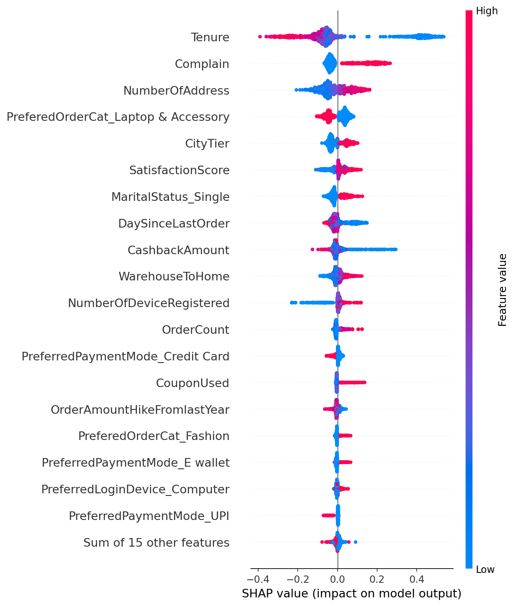
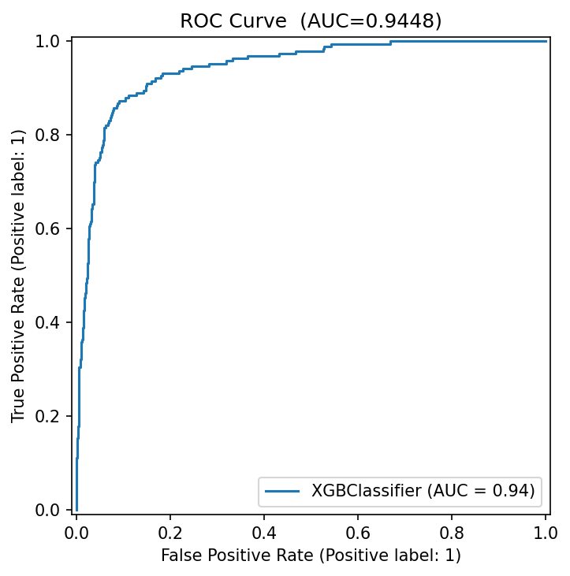
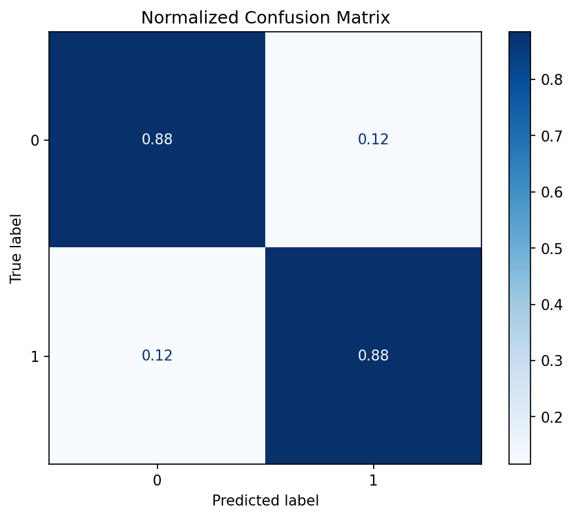
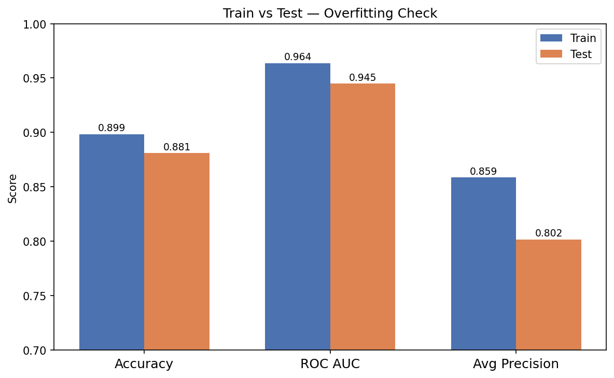
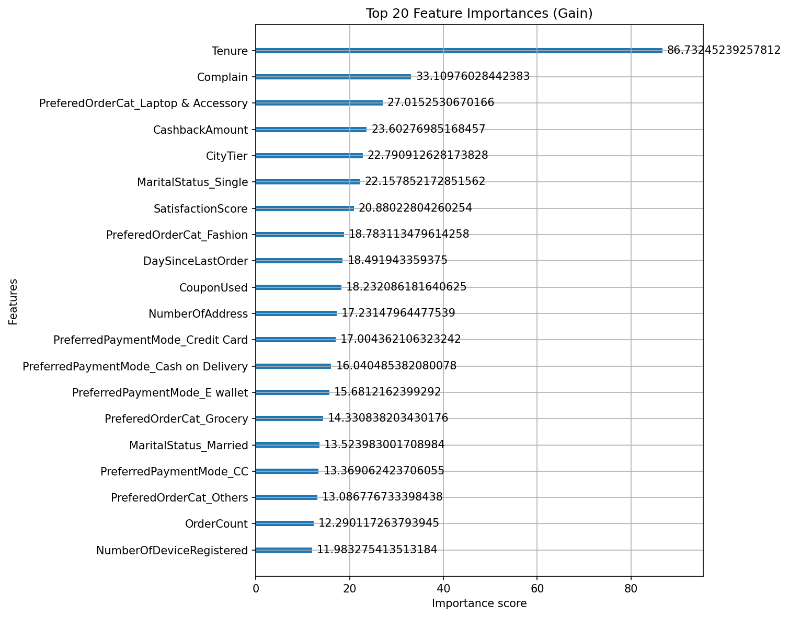

# Phase 3 — E-Commerce Customer Churn Prediction

> **XGBoost + SHAP explainability on imbalanced e-commerce data**  
> Part of a 6-phase Data Science portfolio targeting German tech companies.

---

## Results

| Metric | Test | Train | Gap |
|--------|------|-------|-----|
| Accuracy | **88.1%** | 89.9% | 1.7% |
| ROC AUC | **0.9448** | 0.9637 | 1.9% |
| Average Precision | **0.8018** | 0.8587 | 5.7% |
| Recall (Churners) | **88%** | — | — |
| Class Imbalance | `compute_sample_weight('balanced')` | — | — |

> ✅ Train/Test gap < 2% on AUC — **no overfitting**

---

## Problem Statement

An e-commerce company loses revenue every time a customer churns silently. This project builds a predictive model that flags at-risk customers **before** they leave, and uses SHAP to explain *why* each individual customer is predicted to churn — giving the retention team actionable levers rather than a black-box score.

---

## Dataset

[E-Commerce Customer Churn — ankitverma2010 (Kaggle)](https://www.kaggle.com/datasets/ankitverma2010/ecommerce-customer-churn-analysis-and-prediction)

- **5,630 customers**, 20 features
- **Churn rate: 16.8%** (948 churned / 4,682 retained) — imbalanced dataset
- 7 numerical columns had missing values → filled with column mean

Place the downloaded `.xlsx` file at `data/raw/E Commerce Dataset.xlsx`.

---

## Project Structure

```
phase3-ecommerce-churn/
├── data/
│   ├── raw/                        # original .xlsx (not tracked by git)
│   └── processed/                  # churn_cleaned.csv — output of 01_eda.ipynb
├── notebooks/
│   ├── 01_eda.ipynb                # EDA, cleaning, visualisations
│   └── 02_modeling.ipynb           # XGBoost, evaluation, SHAP, cost-benefit
├── reports/
│   └── figures/
│       ├── churn_distribution.png
│       ├── confusion_matrix.png
│       ├── roc_curve.png
│       ├── pr_curve.png
│       ├── train_vs_test.png
│       ├── feature_importance.png
│       ├── shap_beeswarm.png
│       └── shap_waterfall.png
├── src/
│   └── train.py                    # standalone training script
├── requirements.txt
├── .gitignore
├── LICENSE
└── README.md
```

---

## How to Run

```bash
# 1. Clone and install
git clone https://github.com/<your-username>/phase3-ecommerce-churn
cd phase3-ecommerce-churn
pip install -r requirements.txt

# 2. Place dataset
# Copy your downloaded .xlsx to:  data/raw/E Commerce Dataset.xlsx

# 3. Run EDA notebook first
jupyter notebook notebooks/01_eda.ipynb

# 4. Run modelling notebook
jupyter notebook notebooks/02_modeling.ipynb

# OR run the standalone script directly
python src/train.py
```

---

## Key SHAP Findings

| Feature | Direction | Business Insight |
|---------|-----------|-----------------|
| `Tenure` | Short → high churn | Focus retention efforts on customers in their **first 3 months** |
| `Complain` | Filed complaint → high churn | **Fast complaint resolution** is the single highest-ROI retention action |
| `CashbackAmount` | Low cashback → high churn | Targeted cashback campaigns for at-risk segments |
| `DaySinceLastOrder` | Long inactivity → high churn | Trigger reactivation campaign after **14+ days of silence** |



---

## Evaluation Plots

| ROC Curve | Confusion Matrix |
|-----------|-----------------|
|  |  |

| Train vs Test | Feature Importance |
|---------------|-------------------|
|  |  |

---

## Business Conclusions

1. **The model catches 88% of real churners** before they leave, giving the retention team a daily actionable watchlist.

2. **Precision on churners is 60%** — meaning some false alarms. For churn prediction this is the right trade-off: the cost of sending an unnecessary retention offer is far lower than the cost of missing a real churner.

3. **No overfitting** — train/test AUC gap is only 1.9%, meaning the model generalises well to new customers. This is due to shallow trees (`max_depth=3`) and L1 regularisation (`reg_alpha=1.0`).

4. **SHAP makes every prediction auditable** — each customer gets a personalised explanation of their risk score. This is critical for stakeholder trust and GDPR-compliant AI in German enterprises.

5. **Recommended action:** flag any customer with predicted churn probability ≥ 0.4 for a proactive retention offer (cashback voucher or direct outreach after a complaint).

---

## Technologies

`Python` · `XGBoost` · `SHAP` · `scikit-learn` · `pandas` · `matplotlib` · `seaborn`
